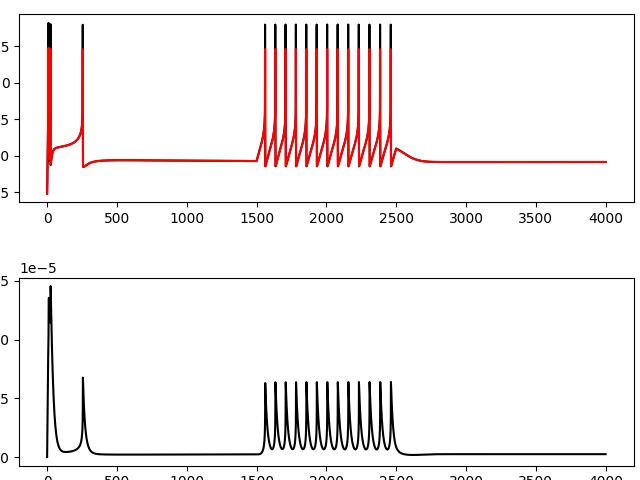
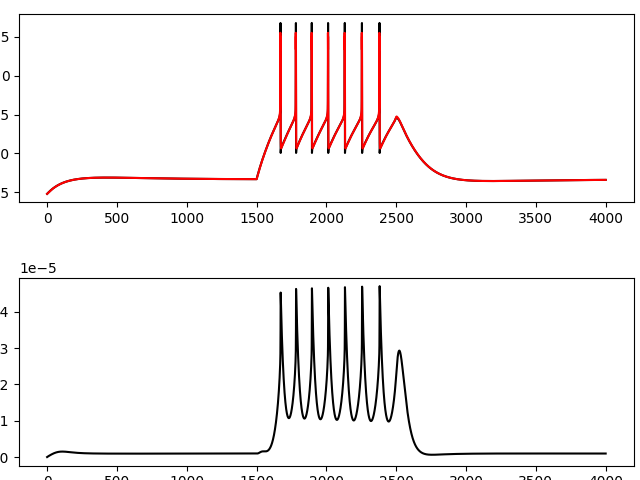

# Database of conductance-based models of thalamocortical neurons

The current database contains only models of thalamocortical relay neurons (TC) in the mouse visual thalamus (dorsal lateral geniculate nucleus) recorded at postnatal day 7 (P7).

## NOTE
Due to the GitHub enforcement of 2fa, which requires me to share my phone number with Microsoft or install an untrusted Microsoft application on my phone, any updates to this repository will be pushed to its clone at GitLab or to my personal git repository. Please see all updates [here](https://rth.r-a-r.org). Sorry, there should be something private in this life where Microsoft, Google or others don't put their noses.


### Software
The model of TC neuron is implemented in `NEURON` simulator.
```
pip3 install --user neuron
```

### Preparations
All necessary `NEURON` modules are located in `mods` directory and borrowed from [Iavarone et al. (2019)](https://senselab.med.yale.edu/ModelDB/ShowModel?model=251881#tabs-1).
You must compile them before any simulation.
```
nrnivmodl mods
```

### The basic model

Even adult TC neurons are relatively electrically compact (Sherman and Guillery, 2004; Bloomfield and Sherman, 1989).
Developing TC neurons have shorter and thicker processes (Charalambakis et al., 2019; El-Danaf et al., 2015).
That allows the usage of a conductance-based ”pen-and-ball” two-compartment model with a single segment for the somatodendritic compartment and a multisegment compartment for an axon.
The model is implemented as a single class in `cell.py`.


### The database
The current database `P07-selected-checked-gmin.json` (last updated 2022-09-21) contains fully validated and human-evaluated 286 sets of model parameters.

### Try a neuron model in the database
To try neurons in the database in the standard current-clamp protocol, you can run `cell.py` with at least two command line arguments: name of the database file and neuron ID.
The third optional command line argument will be interpreted as the amplitude value of the current-clamp protocol.
**Note**  `cell.py` does not read initial conditions for steady-state from the database, and therefore transient dynamics are expected.

Examples

| `python cell.py P07-selected-checked-gmin.json 2 0.1` | `python cell.py P07-selected-checked-gmin.json 280 0.1` |
|:-----------------------------------------------------:|:-------------------------------------------------------:|
|                             |                               |

### Citation
Please use [DOI: 10.5281/zenodo.7312024](https://doi.org/10.5281/zenodo.7312024) as the reference for the database.
